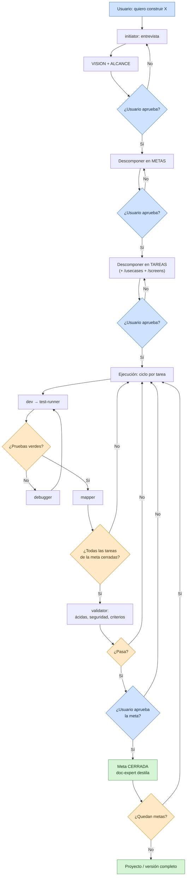

# Roles de Agente y Ciclo de Vida del Proyecto

## Propósito
Dejar **tácito y verificable** el recorrido completo: desde que un agente clona el proyecto y habla por primera vez con el usuario, hasta que todas las metas están logradas, validadas y aprobadas.

Responde a tres preguntas que hasta ahora estaban dispersas:
1. **¿Qué funciones existen** y cuál hace qué.
2. **Cómo nace un proyecto**: de una idea del usuario a metas y tareas ejecutables.
3. **Cuándo se da algo por logrado** y quién lo declara.

---

## 1. Catálogo de funciones

Un `agente_app` (OpenCode, Codex, Whale, Claude Code…) declara en su contrato qué **roles** puede asumir ([`Agent_Contract_Standard.md`](Agent_Contract_Standard.md)). Los roles no son exclusivos: varias herramientas pueden declarar el mismo.

### Roles de arranque

| Rol | Función | Produce |
|---|---|---|
| **`initiator`** | Entrevista al usuario, captura la intención, descompone en metas y tareas | `docs/00_Proyecto/`, `M-*/META.md`, `T-*.md` |

> Skill de referencia: **`/init-project`** ([`../Templates/Init_Skill_Template/SKILL.md`](../Templates/Init_Skill_Template/SKILL.md)).

### Roles de especificación

| Rol | Skill | Función | Produce |
|---|---|---|---|
| **`usecase-architect`** | `/usecases` | Convierte requisitos o código en casos de uso exhaustivos | `UC-<MODULO>-<NNN>` |
| **`screen-architect`** | `/screens` | Convierte casos de uso en fichas de pantalla | `SCR-<MODULO>-<NNN>` |

### Roles de ejecución

Actúan según el `sub_estado` de cada tarea ([`../07_Documentation/Implementation_Log_Standard.md`](../07_Documentation/Implementation_Log_Standard.md)).

| Rol | Entra en | Produce | **No hace** |
|---|---|---|---|
| **`dev`** | `PENDING`, `FIX_REQUIRED` | Código **y sus pruebas** | No ejecuta la suite ni se declara verde |
| **`test-runner`** | `CODE_COMPLETE` | Veredicto pasa / no pasa | **No arregla nada** |
| **`debugger`** | `TEST_FAILED` | Diagnóstico y qué cambiar | **No escribe código** |
| **`validator`** | Meta con todas las tareas cerradas | Pruebas ácidas, edge cases, seguridad, rendimiento | No corrige: reporta y devuelve al ciclo |
| **`mapper`** | `TEST_PASSED` | Mapeo del código funcional | No mapea código en rojo |

### Roles transversales

| Rol | Skill | Función | Escribe |
|---|---|---|---|
| **`doc-expert`** | `/obsidian` | Oráculo y custodio de la bóveda | Toda `docs/` **excepto** `07_Implementacion/` |
| **`pm`** | `/board` | Observa el registro, agrega estado, diagrama | **Solo** `00_TABLERO.md` |

> **La separación es lo que hace posible el relevo.** Un rol que hace el trabajo de otro rompe la cadena: si el `dev` se declara verde, nadie ejecutó las pruebas de verdad.

---

## 2. Interacción con el usuario: obligatoria, no opcional

**Todo agente interactúa con el usuario.** No es un detalle de cortesía: es lo que evita construir lo que nadie pidió.

| Momento | El agente **debe** |
|---|---|
| Al llegar | Declarar quién es y qué funciones trae ([`Agent_Onboarding_Standard.md`](Agent_Onboarding_Standard.md)) |
| Ante ambigüedad | **Preguntar**, no suponer. Lo no confirmado se marca `[SUPUESTO — confirmar]` |
| Al proponer un plan | Presentarlo y **esperar aprobación** antes de ejecutar |
| Al terminar una tarea | Reportar qué hizo, qué falló y qué queda |
| Al cerrar una meta | **Pedir el visto bueno del usuario** contra los criterios de `ALCANCE.md` |

**Nunca** se avanza de fase sin confirmación en los puntos marcados como aprobación.

---

## 3. Ciclo de vida del proyecto

### Fase 0 — Clonar y arrancar (`initiator`)

Cuando un agente llega a un proyecto **vacío o recién clonado**:

```
1. Detecta que no existe docs/00_Proyecto/  →  activa el modo initiator
2. ENTREVISTA al usuario
3. Redacta VISION.md y ALCANCE.md
4. LOS VALIDA con el usuario           ← ITERA hasta aprobación
5. Descompone en METAS (M-*)
6. LAS VALIDA con el usuario           ← ITERA hasta aprobación
7. Descompone cada meta en TAREAS (T-*)
8. LAS VALIDA con el usuario           ← ITERA hasta aprobación
9. Entrega a /obsidian para persistir en la bóveda
```

**No se escribe una línea de código hasta que el usuario aprueba el árbol completo.**

#### Qué pregunta el `initiator`

| Para | Preguntas |
|---|---|
| `VISION.md` | ¿Qué problema resuelve? ¿Para quién? ¿Qué **no** debe ser? ¿Cómo se sabrá que funciona? |
| `ALCANCE.md` | ¿Qué entra en esta versión? ¿Qué queda **explícitamente fuera**? ¿Qué restricciones vienen dadas? |
| Metas | ¿Cuáles son los objetivos separables? ¿Cuál primero? ¿Dependen entre sí? |
| Tareas | Por meta: ¿qué pantallas? ¿qué servicios? ¿qué pruebas? ¿en qué orden? |

Si el usuario no sabe responder algo, se marca `[SUPUESTO — confirmar]` y se lista al final. **No se inventa.**

#### Descomposición canónica de una meta

Toda meta se descompone en tareas de estos tipos, en este orden de dependencia:

```
M-<NNN> Meta
 ├── T-…  tipo: pantalla   ← requiere ficha SCR-* (invocar /screens)
 ├── T-…  tipo: servicio   ← requiere caso de uso UC-* (invocar /usecases)
 ├── T-…  tipo: test       ← E2E derivados de las fichas
 └── T-…  tipo: manual     ← pasos de usuario
```

Si la meta es funcional y ambigua, el `initiator` invoca `/usecases` **antes** de descomponer; si tiene interfaz, `/screens` después. Las ramificaciones de los `UC-*` y las filas del inventario de los `SCR-*` **son** las tareas de test.

---

### Fase 1 — Ejecución iterativa (ciclo circular)

Cada tarea recorre su ciclo. **Nadie asigna: el `sub_estado` enruta.**

```
PENDING ─► CODING ─► CODE_COMPLETE ─► TESTING ─┬─► TEST_PASSED ─► MAPPED ─► COMPLETE
              ▲                                 │
              │                                 ▼
              └──── FIX_REQUIRED ◄──── DEBUG_ANALYSIS ◄──── TEST_FAILED
```

Sin límite de vueltas. El contador `iteracion` las registra; el `pm` alerta a partir de 3 — **es una señal, no un freno**: el ciclo continúa hasta verde.

---

### Fase 2 — Validación de meta (`validator`)

Cuando **todas** las tareas de una meta están en `MAPPED` o `COMPLETE`, entra el `validator`:

| Comprueba | Contra |
|---|---|
| Pruebas ácidas y edge cases | El flujo completo de la meta, no tarea a tarea |
| Seguridad | [`../04_Backend/Security.md`](../04_Backend/Security.md) |
| Rendimiento | [`../05_Frontend/Performance.md`](../05_Frontend/Performance.md) |
| Cobertura | [`../06_Testing/Coverage_Requirements.md`](../06_Testing/Coverage_Requirements.md) |
| Criterios de `ALCANCE.md` | Uno por uno, verificables |
| Deuda de mapeo | Ninguna tarea cerrada sin pasar por `MAPPED` |

**Si encuentra defectos:** devuelve las tareas afectadas a `FIX_REQUIRED` y **el ciclo vuelve a empezar**. El `validator` reporta; no corrige.

**Si pasa todo:** la meta queda `VALIDADA`, pendiente de aprobación del usuario.

---

### Fase 3 — Aprobación del usuario

El `pm` presenta al usuario:

- Criterios de `ALCANCE.md`, uno a uno, con evidencia.
- Informe del `validator`.
- Deuda pendiente, si la hay.
- Iteraciones consumidas.

**El usuario aprueba o rechaza.**

- **Aprueba** → la meta pasa a `CERRADA` y se archiva en `_archivo/`. El `doc-expert` destila a la bóveda lo que debe perdurar.
- **Rechaza** → indica qué falta; se abren tareas nuevas y **el ciclo vuelve a la Fase 1**.

> **Una meta no se cierra sola.** Ni el `pm` ni el `validator` pueden darla por lograda: solo el usuario, contra los criterios que él mismo aprobó en la Fase 0.

---

### Fase 4 — Siguiente meta

Se repite desde la Fase 1 con la siguiente meta, hasta que **todas** están `CERRADAS`. Ese es el fin del proyecto — o de su versión, según `ALCANCE.md`.

---

## 3 bis. Estados de meta (vocabulario cerrado)

Igual que las tareas tienen `sub_estado`, las metas tienen `estado` en su `META.md`:

| Estado | Significa | Quién lo pone | Siguiente |
|---|---|---|---|
| `PLANIFICANDO` | El `initiator` está descomponiendo; el usuario aún no aprobó | `initiator` | `ACTIVA` al aprobar |
| `ACTIVA` | Tareas en ejecución | `initiator` tras aprobación | `EN_VALIDACION` |
| `EN_VALIDACION` | Todas las tareas en `MAPPED`/`COMPLETE`; el `validator` trabaja | `pm` | `VALIDADA` o `ACTIVA` |
| `VALIDADA` | El `validator` dio OK; falta la aprobación del usuario | `validator` | `CERRADA` o `ACTIVA` |
| `CERRADA` | El usuario aprobó | **Usuario** (lo registra el `pm`) | → `_archivo/` |
| `BLOQUEADA` | No puede avanzar por una dependencia externa | cualquiera | `ACTIVA` al desbloquear |

### Transiciones que vuelven atrás

```
EN_VALIDACION ──validator encuentra defectos──► ACTIVA   (tareas a FIX_REQUIRED)
VALIDADA ──────usuario rechaza───────────────► ACTIVA   (tareas nuevas)
```

**`CERRADA` solo la pone el usuario.** Ni el `pm` ni el `validator` pueden llegar a ese estado
por su cuenta — el `pm` únicamente lo registra tras la aprobación.

---

## 4. Medición del progreso

El `pm` mantiene en `00_TABLERO.md` ([`Project_Manager.md`](Project_Manager.md)):

| Nivel | Métrica | De dónde sale |
|---|---|---|
| **Proyecto** | Metas cerradas / totales | Estado de cada `META.md` |
| **Meta** | Tareas cerradas / totales · iteraciones máx · deuda de mapeo | Frontmatter de los `T-*.md` |
| **Tarea** | Sub-estado · iteraciones · bloqueadores | Frontmatter |
| **Agente** | Intervenciones por `agente_app` y `rol_experto` | Bitácoras y logs diarios |

Toda métrica sale de un **dato del registro**. Si no hay dato, no hay métrica.

---

## 5. Diagrama del ciclo completo



---

## 6. Reglas

1. **No se codifica sin plan aprobado.** El árbol visión → metas → tareas se valida con el usuario antes de escribir código.
2. **No se inventa la intención.** Lo que el usuario no confirmó se marca `[SUPUESTO — confirmar]`.
3. **El ciclo itera sin límite** hasta verde. Las alertas de iteración informan; no detienen.
4. **Una meta no se cierra sin `validator` y sin usuario.** Ninguno de los dos basta por separado.
5. **Cada rol respeta su límite.** Un rol que hace el trabajo de otro invalida el relevo.
6. **Todo queda registrado**: quién (`agente_app` + `rol_experto`), cuándo (al segundo), qué resultado.
7. **El progreso se mide con datos del registro**, nunca con estimaciones.

---

## Anti-patrones

- ❌ Empezar a codificar sin `docs/00_Proyecto/` aprobado.
- ❌ Descomponer metas sin validarlas con el usuario.
- ❌ Cerrar una meta porque las tareas están verdes, sin `validator` ni aprobación.
- ❌ Que el `validator` corrija en vez de reportar.
- ❌ Detener el ciclo por exceso de iteraciones en vez de investigar la causa.
- ❌ Inventar metas o tareas que el usuario no pidió (viola `ALCANCE.md → fuera de alcance`).
- ❌ Reportar progreso con estimaciones en lugar de datos del registro.
- ❌ Avanzar de fase sin la aprobación requerida.

## Relacionado
- [`Agent_Onboarding_Standard.md`](Agent_Onboarding_Standard.md), [`Agent_Contract_Standard.md`](Agent_Contract_Standard.md), [`Agent_Workflow.md`](Agent_Workflow.md), [`Project_Manager.md`](Project_Manager.md), [`UseCase_Architect.md`](UseCase_Architect.md), [`Screen_Architect.md`](Screen_Architect.md), [`Documentation_Expert.md`](Documentation_Expert.md), [`../07_Documentation/Implementation_Log_Standard.md`](../07_Documentation/Implementation_Log_Standard.md), [`../00_Governance/Project_Context_Standard.md`](../00_Governance/Project_Context_Standard.md)
