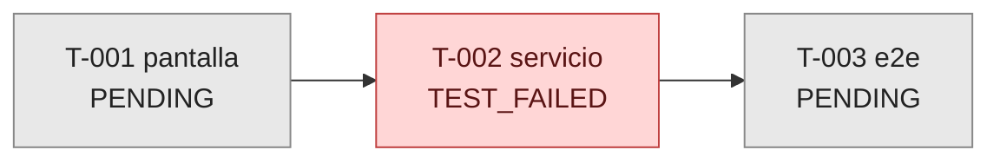

# M-<NNN> — Índice de tareas

> Vista de estado de la meta. La regenera el **Project Manager** (`/board`); los agentes la
> **leen** para saber si hay una tarea cuyo `siguiente_rol` les corresponde.

**Meta:** [`META.md`](META.md) · **Actualizado:** `<YYYY-MM-DDTHH:MM:SSZ>`

## Tareas

| tarea | titulo | tipo | sub_estado | iteracion | depende_de | siguiente_rol | actualizado |
|---|---|---|---|---|---|---|---|
| [T-001](T-001_<nombre>.md) | <título> | pantalla | `PENDING` | 0 | — | `dev` | <ts> |
| [T-002](T-002_<nombre>.md) | <título> | servicio | `TEST_FAILED` | 2 | T-001 | `debugger` | <ts> |

## Estado de la meta

> Colores por sub-estado: gris `PENDING` · azul en curso (`CODING`, `TESTING`,
> `DEBUG_ANALYSIS`) · rojo `TEST_FAILED`/`FIX_REQUIRED` · verde `TEST_PASSED`/`MAPPED` ·
> morado `COMPLETE`.

## Deuda de mapeo

*Tareas en `TEST_PASSED` o `COMPLETE` que nunca pasaron por `MAPPED`.*

| tarea | sub_estado | cerrada desde |
|---|---|---|
| — | — | — |

## Bitácoras diarias

Ver [`_log/`](_log/) — un archivo por día con todos los eventos de la meta.
