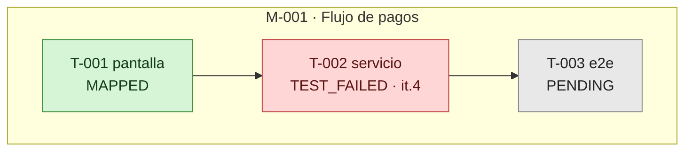
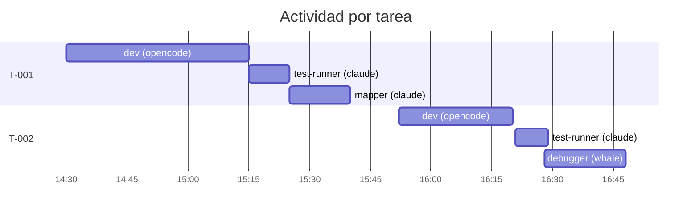

# Tablero de Implementación

> **Solo el Project Manager escribe este archivo** (`/board`). Todos los demás lo leen.
> Se regenera completo en cada pasada; no se edita a mano.

**Actualizado:** `<YYYY-MM-DDTHH:MM:SSZ>`

## Estado global

| meta | titulo | estado | tareas | sub_estado_critico | iteraciones_max | sin_mapear | ultimo_evento | alerta |
|---|---|---|---|---|---|---|---|---|
| [M-001](M-001_<nombre>/META.md) | <título> | `ACTIVA` | 3/7 | `TEST_FAILED` | 4 | 2 | <ts> | T-002: 4 iteraciones |

> Estados de meta: `PLANIFICANDO` · `ACTIVA` · `EN_VALIDACION` · `VALIDADA` · `CERRADA` · `BLOQUEADA`.
> Una meta en `VALIDADA` **espera aprobación del usuario** — señálalo como acción pendiente.

## Alertas activas

*Toda alerta cita la tarea y el timestamp que la origina. Sin dato, no hay alerta.*

| tipo | meta | tarea | detalle | desde |
|---|---|---|---|---|
| Ciclo excesivo | M-001 | T-002 | 4 iteraciones (umbral 3) | <ts> |
| Estancamiento | — | — | — | — |
| Deuda de mapeo | — | — | — | — |
| Bloqueo sin dueño | — | — | — | — |
| Dependencia rota | — | — | — | — |

## Mapa de estado

## Línea de tiempo

## Iteraciones por tarea

| tarea | iteraciones | umbral | estado |
|---|---|---|---|
| T-001 | 1 | 3 | OK |
| T-002 | 4 | 3 | ⚠️ excede |

## Cambios desde la última pasada

- <qué se movió, con timestamps>
