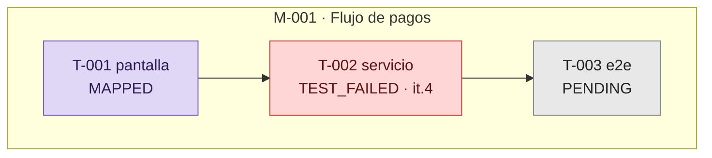
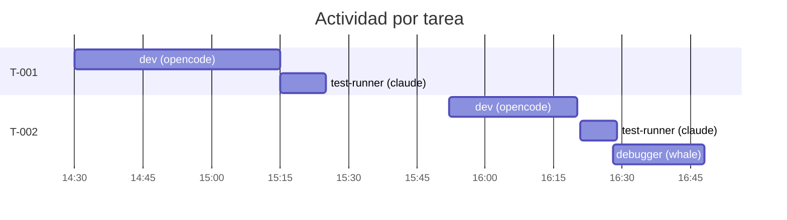
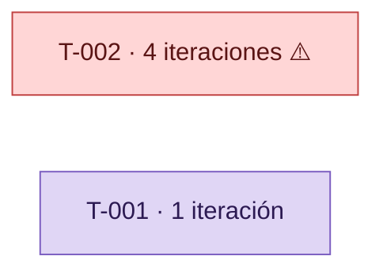

# Referencia: tablero, diagramas y alertas (para el skill /board)

Material de apoyo que el PM carga bajo demanda: paleta de sub-estados, definiciones Mermaid y
fórmulas exactas de cada alerta.

---

## Paleta por sub-estado (usar igual en todos los diagramas)

| Grupo | Sub-estados | Clase | Relleno / borde |
|---|---|---|---|
| Pendiente | `PENDING` | `pending` | `#e8e8e8` / `#888` |
| En curso | `CODING`, `TESTING`, `DEBUG_ANALYSIS` | `wip` | `#cfe3ff` / `#3b6fb6` |
| En rojo | `TEST_FAILED`, `FIX_REQUIRED` | `failed` | `#ffd6d6` / `#c04141` |
| En verde | `CODE_COMPLETE`, `TEST_PASSED` | `passed` | `#d6f5d6` / `#3f9142` |
| Cerrado | `MAPPED`, `COMPLETE` | `done` | `#e0d6f5` / `#7a5cc0` |

Bloque de clases a incluir en cada `graph`:

```
classDef pending fill:#e8e8e8,stroke:#888,color:#222
classDef wip     fill:#cfe3ff,stroke:#3b6fb6,color:#0b2b52
classDef failed  fill:#ffd6d6,stroke:#c04141,color:#5a1414
classDef passed  fill:#d6f5d6,stroke:#3f9142,color:#123d16
classDef done    fill:#e0d6f5,stroke:#7a5cc0,color:#2c1a52
```

> Los colores llevan `color:` explícito para que el texto se lea en tema claro y oscuro.

---

## Diagrama 1 — Mapa de estado

Un `subgraph` por meta; un nodo por tarea; las flechas salen de `depende_de`.



Etiqueta del nodo: `<id> <tipo><br/><SUB_ESTADO>`, y `· it.<n>` solo si `iteracion` > 1.

---

## Diagrama 2 — Línea de tiempo

Una `section` por tarea; una barra por intervención, tomada de `_log/`.
Etiqueta de barra: `<rol_experto> (<agente_app>)`.



Duración = diferencia hasta el siguiente evento de esa tarea. Si es el último y la tarea está
en un sub-estado ocupado, usa "hasta ahora" y marca estancamiento si procede.

---

## Diagrama 3 — Iteraciones

Solo si alguna tarea supera el umbral. Barras horizontales por tarea:



---

## Fórmulas de alerta (exactas)

| Alerta | Fórmula | Cita |
|---|---|---|
| **Ciclo excesivo** | `iteracion > 3` | tarea + valor |
| **Estancamiento** | `sub_estado ∈ {CODING, TESTING, DEBUG_ANALYSIS}` y `now - actualizado > 2h` | tarea + `actualizado` |
| **Deuda de mapeo** | `sub_estado ∈ {TEST_PASSED, COMPLETE}` y `MAPPED` nunca aparece en su bitácora | tarea + `actualizado` |
| **Bloqueo sin dueño** | `bloqueadores ≠ ninguno` y `sub_estado` es un estado ocupado (nadie entra) | tarea + bloqueador |
| **Dependencia rota** | tarea con `sub_estado ≠ PENDING` cuya `depende_de` no está en `{MAPPED, COMPLETE}` | ambas tareas |

Umbrales por defecto: **3 iteraciones**, **2 horas** de inactividad. Ajustables por proyecto;
si se cambian, decláralo en el tablero.

---

## Estructura de `00_TABLERO.md`

```markdown
# Tablero de Implementación

**Actualizado:** <ts>

## Estado global
| meta | titulo | tareas | sub_estado_critico | iteraciones_max | sin_mapear | ultimo_evento | alerta |

## Alertas activas
| tipo | meta | tarea | detalle | desde |

## Mapa de estado
```mermaid …```

## Línea de tiempo
```mermaid …```

## Iteraciones por tarea
| tarea | iteraciones | umbral | estado |

## Cambios desde la última pasada
- …
```

### Cálculo de las columnas del estado global

| Columna | Cómo se calcula |
|---|---|
| `tareas` | tareas en `COMPLETE` / total |
| `sub_estado_critico` | el sub-estado con más tareas detenidas, priorizando los rojos |
| `iteraciones_max` | máximo de `iteracion` entre las tareas de la meta |
| `sin_mapear` | número de tareas con deuda de mapeo |
| `ultimo_evento` | máximo `actualizado` de la meta |
| `alerta` | la alerta más severa: ciclo > estancamiento > deuda > dependencia |

---

## Errores a evitar

- Parchear un diagrama en vez de regenerarlo entero.
- Emitir una alerta sin timestamp que la respalde.
- Usar colores distintos entre el tablero y los índices de meta.
- Leer bitácoras completas cuando el frontmatter basta (gasto de contexto).
- Corregir un `sub_estado` mal puesto en una tarea: repórtalo, no lo edites.
