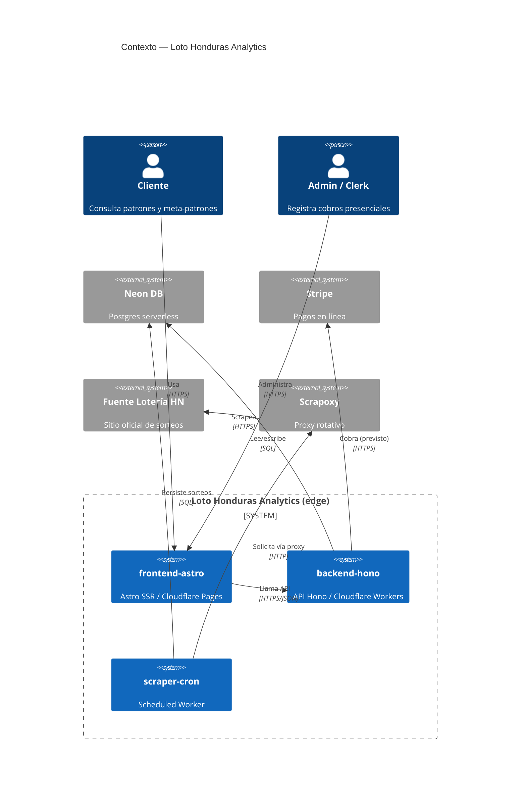

# C4 · Diagrama de Contexto

[[00_MAPA_DE_CONTENIDOS|Mapa de Contenidos]]

Nivel 1 del modelo C4: el sistema **Loto Honduras Analytics** y sus actores y sistemas externos. Decisión arquitectónica en [[02_Arquitectura/adr/0002-arquitectura-edge-cloudflare|ADR-0002]].

## Actores
- **Cliente (`customer`):** consulta patrones de nivel 1 y, si está suscrito, meta-patrones premium. Móvil-first.
- **Administrador (`admin`):** gestiona el sistema y registra cobros presenciales.
- **Clerk (ventanilla):** cobra efectivo y registra el cobro presencial.

## Sistema
- **Loto Honduras Analytics** — plataforma analítica *edge-first*:
  - `frontend-astro` (Astro SSR en Cloudflare Pages).
  - `backend-hono` (API en Cloudflare Workers).
  - `scraper-cron` (Cloudflare Scheduled Worker).

## Sistemas externos
- **Cloudflare (edge):** ejecuta frontend, API y cron en nodos perimetrales globales.
- **Neon DB:** Postgres serverless de producción (vía `@neondatabase/serverless`).
- **Stripe:** pagos en línea (vía pago `stripe`). *Integración prevista (módulo `payments/` protegido); aún no implementada en el andamiaje.*
- **Fuente oficial de la Lotería de Honduras:** sitio del que se extraen los sorteos.
- **Scrapoxy:** súper-proxy rotativo que intermedia las peticiones del scraper hacia la fuente para evitar bloqueos.

## Diagrama (Mermaid)

## Historial de cambios
- 2026-06-20: creación inicial.
