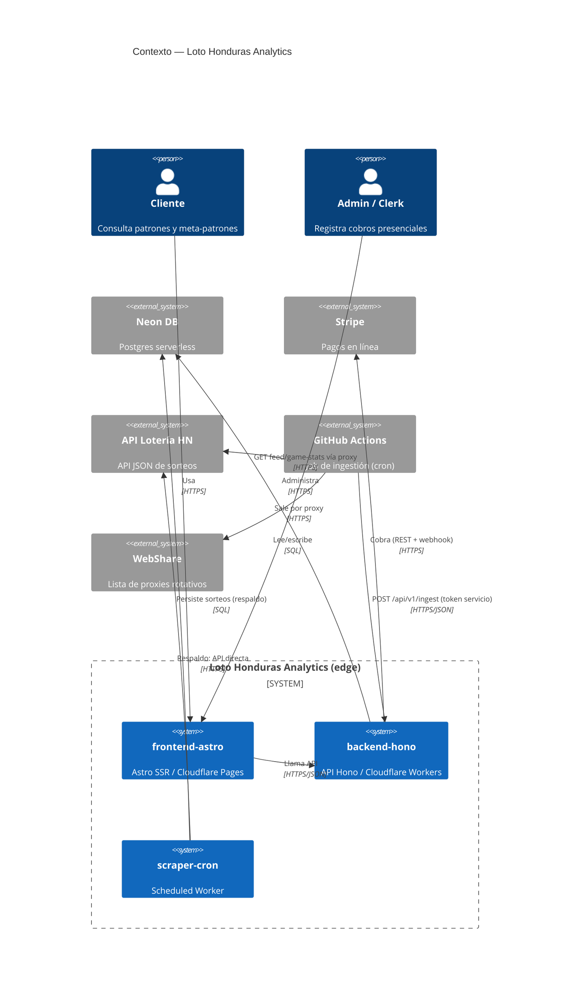

# C4 · Diagrama de Contexto

[[00_MAPA_DE_CONTENIDOS|Mapa de Contenidos]]

Nivel 1 del modelo C4: el sistema **Loto Honduras Analytics** y sus actores y sistemas externos. Decisión arquitectónica en [[02_Arquitectura/adr/0002-arquitectura-edge-cloudflare|ADR-0002]].

## Actores
- **Cliente (`customer`):** consulta patrones de nivel 1 y, si está suscrito, meta-patrones premium. Móvil-first.
- **Administrador (`admin`):** gestiona el sistema y registra cobros presenciales.
- **Clerk (ventanilla):** cobra efectivo y registra el cobro presencial.

## Sistema
- **Loto Honduras Analytics** — plataforma analítica *edge-first*:
  - `frontend-astro` (Astro SSR en Cloudflare Pages).
  - `backend-hono` (API en Cloudflare Workers).
  - `scraper-cron` (Cloudflare Scheduled Worker).

## Sistemas externos
- **Cloudflare (edge):** ejecuta frontend, API y cron en nodos perimetrales globales.
- **Neon DB:** Postgres serverless de producción (vía `@neondatabase/serverless`).
- **Stripe:** pagos en línea (vía pago `stripe`). Integración **implementada** vía API REST + webhook firmado en el módulo 🔒 [[04_Modulos/Pagos|Pagos]] (ver [[02_Arquitectura/adr/0003-pagos-stripe-via-rest-en-edge|ADR-0003]]).
- **API de la Lotería de Honduras:** API JSON (`api.loteriasdehonduras.com`) de la que se obtienen los sorteos.
- **GitHub Actions:** ejecuta el job de ingestión principal (Node) en cron, fuera de Cloudflare.
- **WebShare:** lista de proxies rotativos por la que sale el job de Actions hacia la API. Ver [[02_Arquitectura/adr/0005-ingestion-github-actions-webshare|ADR-0005]].

## Diagrama (Mermaid)

```mermaid
C4Context
  title Contexto — Loto Honduras Analytics
  Person(cust, "Cliente", "Consulta patrones y meta-patrones")
  Person(admin, "Admin / Clerk", "Registra cobros presenciales")
  System_Boundary(sys, "Loto Honduras Analytics (edge)") {
    System(fe, "frontend-astro", "Astro SSR / Cloudflare Pages")
    System(be, "backend-hono", "API Hono / Cloudflare Workers")
    System(cron, "scraper-cron", "Scheduled Worker")
  }
  System_Ext(neon, "Neon DB", "Postgres serverless")
  System_Ext(stripe, "Stripe", "Pagos en línea")
  System_Ext(loto, "API Lotería HN", "API JSON de sorteos")
  System_Ext(gha, "GitHub Actions", "Job de ingestión (cron)")
  System_Ext(proxy, "WebShare", "Lista de proxies rotativos")

  Rel(cust, fe, "Usa", "HTTPS")
  Rel(admin, fe, "Administra", "HTTPS")
  Rel(fe, be, "Llama API", "HTTPS/JSON")
  Rel(be, neon, "Lee/escribe", "SQL")
  Rel(be, stripe, "Cobra (REST + webhook)", "HTTPS")
  Rel(gha, proxy, "Sale por proxy", "HTTPS")
  Rel(gha, loto, "GET feed/game-stats vía proxy", "HTTPS")
  Rel(gha, be, "POST /api/v1/ingest (token servicio)", "HTTPS/JSON")
  Rel(cron, loto, "Respaldo: API directa", "HTTPS")
  Rel(cron, neon, "Persiste sorteos (respaldo)", "SQL")
```

## Historial de cambios
- 2026-06-25: ingestión rediseñada — fuente API JSON; añadidos **GitHub Actions** (job principal) y **WebShare** (proxy); el Worker `scraper-cron` queda como respaldo. Decodo anulado. Ver [[02_Arquitectura/adr/0005-ingestion-github-actions-webshare|ADR-0005]].
- 2026-06-23: (anulado) proxy Scrapoxy→Decodo.
- 2026-06-21: Stripe pasa de "previsto" a integración implementada (módulo Pagos, ADR-0003).
- 2026-06-20: creación inicial.
