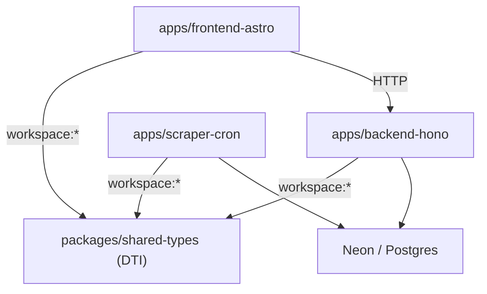

# Dependencias entre apps y paquetes

[[00_MAPA_DE_CONTENIDOS|Mapa de Contenidos]]

Monorepo **pnpm + Turborepo**. Las apps dependen de `packages/shared-types`; nunca al revés.

## Grafo

## Reglas de dirección
- **`shared-types` es la base (DTI):** define tipos de dominio y contratos de API. No depende de ninguna app. 🔒 protegido en `.aicodeprotect.yml` (un cambio rompe las tres apps a la vez).
- **`backend-hono`** consume `shared-types` (`@loto/shared-types`, `workspace:*`) y accede a la BD vía Drizzle.
- **`scraper-cron`** consume `shared-types` (p. ej. `GameType`, `ParsedDraw`) y escribe en `lottery_history`.
- **`frontend-astro`** consume `shared-types` y se comunica con el backend solo por **HTTP** (no importa código de backend).
- **El backend NO depende del frontend ni del scraper.** El acoplamiento entre apps es exclusivamente a través de tipos compartidos y de la API HTTP.

## Implicaciones
- Cambiar un tipo en `shared-types` exige análisis de impacto en las tres apps (ver protección).
- El frontend puede desplegarse y evolucionar de forma independiente mientras respete el [[02_Arquitectura/API|contrato de API]].

## Historial de cambios
- 2026-06-20: creación inicial.
