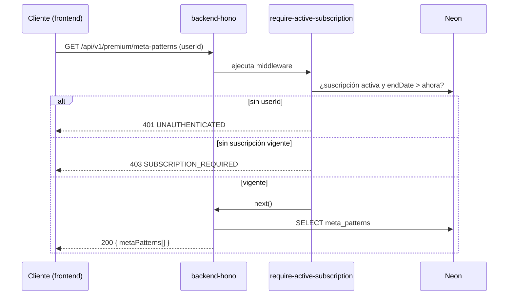

# Flujo: Acceso a meta-patrones premium

[[00_MAPA_DE_CONTENIDOS|Mapa de Contenidos]]

Caso de uso [[01_Dominio/Casos_de_Uso#CU-02|CU-02]]. Cómo un cliente accede a los [[01_Dominio/Glosario#Patrones|meta-patrones]] de nivel 2.

## Actores
- Cliente (con o sin suscripción), backend (`require-active-subscription`).

## Secuencia

## Reglas
- Acceso ⇔ `isActive = true` **y** `endDate > ahora`.
- La suscripción puede provenir de Stripe o de un [[05_Procesos/Flujo_Cobro_Presencial|cobro presencial]]; el flujo es idéntico desde aquí.

## Pendiente
- En producción `userId` debe venir del **JWT**, no del query (andamiaje). Ver [[04_Modulos/Suscripciones|Suscripciones]].

## Historial de cambios
- 2026-06-20: creación inicial.
