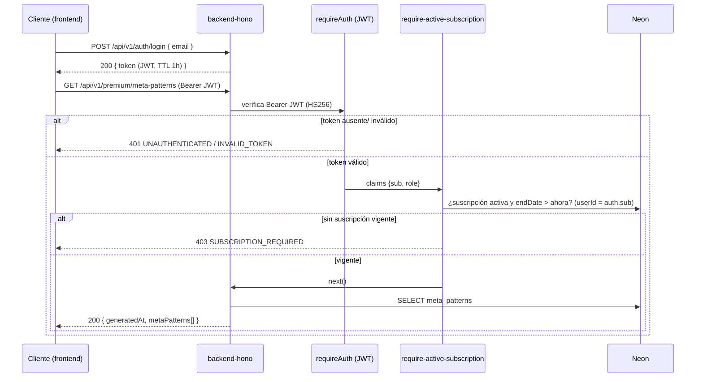

# Flujo: Acceso a meta-patrones premium

[[00_MAPA_DE_CONTENIDOS|Mapa de Contenidos]]

Caso de uso [[01_Dominio/Casos_de_Uso#CU-02|CU-02]]. Cómo un cliente accede a los [[01_Dominio/Glosario#Patrones|meta-patrones]] de nivel 2.

## Actores
- Cliente (con o sin suscripción), backend (`requireAuth` + `require-active-subscription`).

## Secuencia

## Reglas
- Identidad **siempre** desde el JWT (`auth.sub`); no se acepta `userId` por query.
- Acceso ⇔ `isActive = true` **y** `endDate > ahora`.
- La suscripción puede provenir de [[05_Procesos/Flujo_Pago_Online|Stripe (pago online)]] o de un [[05_Procesos/Flujo_Cobro_Presencial|cobro presencial]]; el flujo es idéntico desde aquí.

## Historial de cambios
- 2026-06-21: el flujo arranca con `auth/login` → JWT; la verificación de suscripción toma el `userId` del JWT (eliminado el query). Resuelto el pendiente de andamiaje.
- 2026-06-20: creación inicial.
