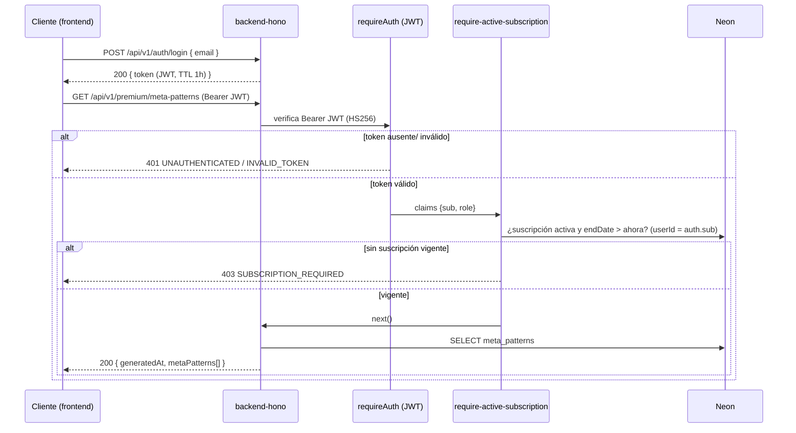

# Flujo: Acceso a meta-patrones premium

[[00_MAPA_DE_CONTENIDOS|Mapa de Contenidos]]

Caso de uso [[01_Dominio/Casos_de_Uso#CU-02|CU-02]]. Cómo un cliente accede a los [[01_Dominio/Glosario#Patrones|meta-patrones]] de nivel 2.

## Actores
- Cliente (con o sin suscripción), backend (`requireAuth` + `require-active-subscription`).

## Secuencia

```mermaid
sequenceDiagram
  participant C as Cliente (frontend)
  participant API as backend-hono
  participant AU as requireAuth (JWT)
  participant MW as require-active-subscription
  participant DB as Neon
  C->>API: POST /api/v1/auth/login { email }
  API-->>C: 200 { token (JWT, TTL 1h) }
  C->>API: GET /api/v1/premium/meta-patterns (Bearer JWT)
  API->>AU: verifica Bearer JWT (HS256)
  alt token ausente/ inválido
    AU-->>C: 401 UNAUTHENTICATED / INVALID_TOKEN
  else token válido
    AU->>MW: claims {sub, role}
    MW->>DB: ¿suscripción activa y endDate > ahora? (userId = auth.sub)
    alt sin suscripción vigente
      MW-->>C: 403 SUBSCRIPTION_REQUIRED
    else vigente
      MW->>API: next()
      API->>DB: SELECT meta_patterns
      API-->>C: 200 { generatedAt, metaPatterns[] }
    end
  end
```

## Reglas
- Identidad **siempre** desde el JWT (`auth.sub`); no se acepta `userId` por query.
- Acceso ⇔ `isActive = true` **y** `endDate > ahora`.
- La suscripción puede provenir de [[05_Procesos/Flujo_Pago_Online|Stripe (pago online — L. 200.00/30 días)]], de un [[05_Procesos/Flujo_Cobro_Presencial|cobro presencial]], del **trial automático de 30 días** al registrarse, de un **recibo compartido** (usuario envía su comprobante → soporte@oged-solutions.com → admin confirma 30 días), o ser asignada por un admin vía `PATCH /api/v1/admin/users/:id/subscription` (trial 30 días; efectivo por meses). **Tiempo de gracia:** si `settings/plans.showPaidPlan` es `false` (def.), el plan de pago se oculta en `/premium` y solo se muestra el trial; el admin alterna ese flag.

## Historial de cambios
- 2026-09-05: **trial de 30 días**, **tiempo de gracia configurable** (`showPaidPlan`, def. off) y **recibo compartido** (usuario → soporte → admin confirma 30 días).
- 2026-09-05: plan único **L. 200.00/30 días**; trial fijo de **15 días** (registro, Google y admin).
- 2026-09-05: añadida la vía de asignación de plan por admin (`PATCH /admin/users/:id/subscription`) y los planes visibles sin sesión en `/premium`.
- 2026-06-21: el flujo arranca con `auth/login` → JWT; la verificación de suscripción toma el `userId` del JWT (eliminado el query). Resuelto el pendiente de andamiaje.
- 2026-06-20: creación inicial.
