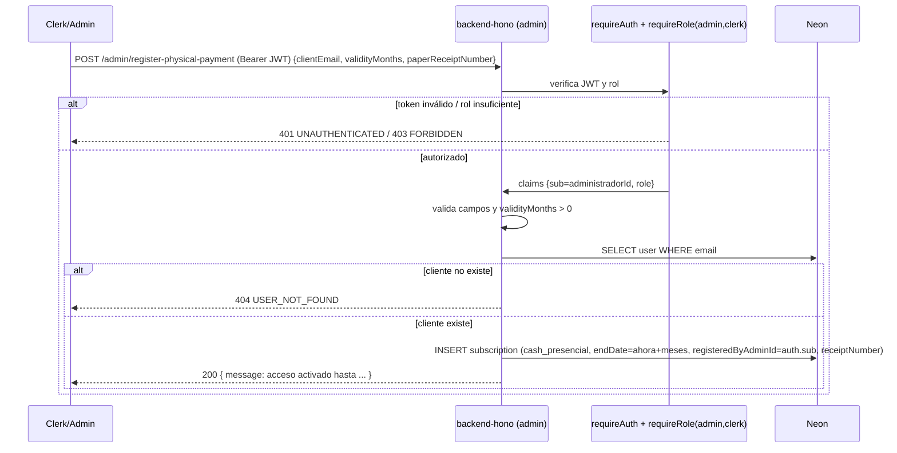

# Flujo: Cobro presencial en ventanilla

[[00_MAPA_DE_CONTENIDOS|Mapa de Contenidos]]

Caso de uso [[01_Dominio/Casos_de_Uso#CU-03|CU-03]]. Activación de suscripción tras cobrar efectivo. Módulo 🔒 [[04_Modulos/Admin_Cobros_Presenciales|Admin · Cobros presenciales]].

## Actores
- Clerk/Admin (operador de ventanilla), cliente (presente), backend.

## Precondiciones
- El cliente ya está registrado (existe por email).
- El operador cobra el efectivo y emite un recibo físico con número correlativo.

## Secuencia

## Auditoría
- El operador (`registeredByAdminId`) se toma del **JWT verificado**, no del body: no es suplantable.
- Queda registro de **quién** cobró y **qué recibo** lo respalda (`receiptNumber`).

## Pendiente
- Controlar duplicados/correlatividad del recibo (sin validar a nivel de BD). Ver [[04_Modulos/Admin_Cobros_Presenciales|módulo]].

## Historial de cambios
- 2026-06-21: el flujo exige `requireAuth` + `requireRole("admin","clerk")` y deriva el `administradorId` del JWT; añadida validación de campos. Resuelto el `TODO(auth)`.
- 2026-06-20: creación inicial.
