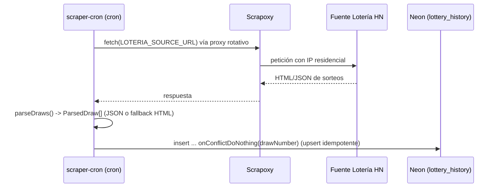

# Flujo: Ingestión periódica vía scraping

[[00_MAPA_DE_CONTENIDOS|Mapa de Contenidos]]

Caso de uso [[01_Dominio/Casos_de_Uso#CU-04|CU-04]]. Cómo el [[04_Modulos/Scraper_Ingestion|scraper-cron]] alimenta el histórico de sorteos.

## Actor
- Sistema (Cloudflare Scheduled Worker), Scrapoxy, fuente oficial.

## Secuencia

## Reglas
- **Disparo:** cron **22:00 UTC** (`wrangler.toml`) → `scheduled` → `runScrape`.
- **Parseo:** `parseDraws` admite JSON (claves EN/ES) y fallback HTML por atributos `data-*`; `normalizeGame` mapea alias a `GameType`. Solo se persisten sorteos con todos los campos válidos.
- **Idempotencia:** `drawNumber` es único; el `onConflictDoNothing` evita duplicar al reingestar.
- Tras la ingestión, los datos quedan disponibles para recalcular [[04_Modulos/Patrones|patrones]].

## Pendiente
- Confirmar el **markup HTML real** de la fuente (el fallback `data-*` es provisional) y añadir reintentos/backoff. Ver [[04_Modulos/Scraper_Ingestion|módulo]].

## Historial de cambios
- 2026-06-21: implementación real — fetch a `LOTERIA_SOURCE_URL`, parseo JSON/HTML y upsert idempotente; cron 22:00 UTC. Estado activo; resuelto el pendiente de andamiaje.
- 2026-06-20: creación inicial (estado andamiaje).
