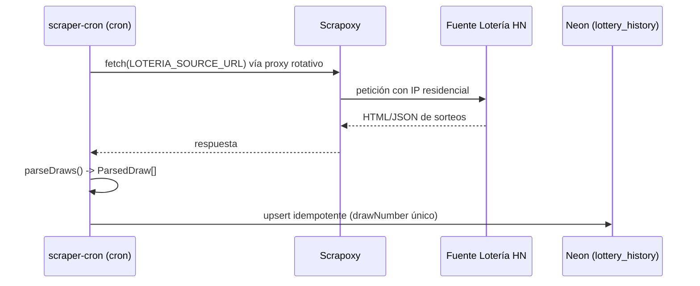

# Flujo: Ingestión periódica vía scraping

[[00_MAPA_DE_CONTENIDOS|Mapa de Contenidos]]

Caso de uso [[01_Dominio/Casos_de_Uso#CU-04|CU-04]]. Cómo el [[04_Modulos/Scraper_Ingestion|scraper-cron]] alimenta el histórico de sorteos.

## Actor
- Sistema (Cloudflare Scheduled Worker), Scrapoxy, fuente oficial.

## Secuencia

## Reglas
- **Idempotencia:** `drawNumber` es único; reingestar el mismo sorteo no debe duplicar.
- Tras la ingestión, los datos quedan disponibles para recalcular [[04_Modulos/Patrones|patrones]].

## Pendiente
- **Andamiaje:** `parseDraws` y el `scheduled` no implementan fetch real, parseo ni upsert; falta definir la frecuencia del cron y el manejo de errores/reintentos. Ver [[04_Modulos/Scraper_Ingestion|módulo]].

## Historial de cambios
- 2026-06-20: creación inicial (estado andamiaje).
