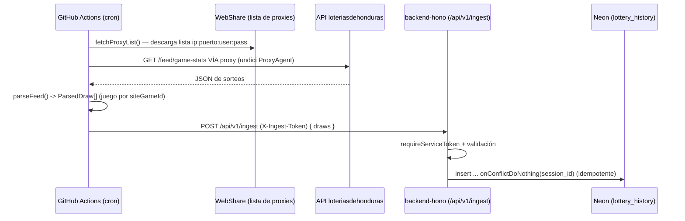
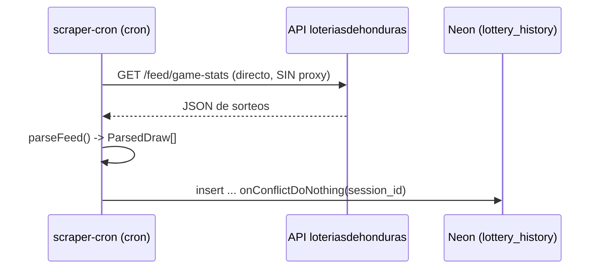

# Flujo: Ingestión periódica de sorteos

[[00_MAPA_DE_CONTENIDOS|Mapa de Contenidos]]

Caso de uso [[01_Dominio/Casos_de_Uso#CU-04|CU-04]]. Cómo se alimenta el histórico de sorteos. Ver [[04_Modulos/Scraper_Ingestion|módulo de ingestión]] y [[02_Arquitectura/adr/0005-ingestion-github-actions-webshare|ADR-0005]].

## Actores
- **Vía principal:** job de **GitHub Actions** (Node) + proxy **WebShare** + API oficial + backend.
- **Vía respaldo:** Worker `scraper-cron` (Cloudflare), llamada **directa** a la API.

## Secuencia — vía principal (GitHub Actions)

```mermaid
sequenceDiagram
  participant GA as GitHub Actions (cron)
  participant WS as WebShare (lista de proxies)
  participant API as API loteriasdehonduras
  participant BE as backend-hono (/api/v1/ingest)
  participant DB as Neon (lottery_history)
  GA->>WS: fetchProxyList() — descarga lista ip:puerto:user:pass
  GA->>API: GET /feed/game-stats VÍA proxy (undici ProxyAgent)
  API-->>GA: JSON de sorteos
  GA->>GA: parseFeed() -> ParsedDraw[] (juego por siteGameId)
  GA->>BE: POST /api/v1/ingest (X-Ingest-Token) { draws }
  BE->>BE: requireServiceToken + validación
  BE->>DB: insert ... onConflictDoNothing(session_id) (idempotente)
```

## Secuencia — vía respaldo (Worker)

```mermaid
sequenceDiagram
  participant CR as scraper-cron (cron)
  participant API as API loteriasdehonduras
  participant DB as Neon (lottery_history)
  CR->>API: GET /feed/game-stats (directo, SIN proxy)
  API-->>CR: JSON de sorteos
  CR->>CR: parseFeed() -> ParsedDraw[]
  CR->>DB: insert ... onConflictDoNothing(session_id)
```

## Reglas
- **Por qué dos vías:** `fetch` de Cloudflare Workers no admite proxy a nivel de socket (lo que da WebShare); por eso la vía con proxy corre en Node (Actions) y el Worker queda como respaldo directo. Ver [[02_Arquitectura/adr/0005-ingestion-github-actions-webshare|ADR-0005]].
- **Identidad del juego:** por `siteGameId` (fiable); el `horario` del crudo no.
- **Auth de ingestión:** `POST /api/v1/ingest` exige `X-Ingest-Token` (token de servicio), no JWT de usuario.
- **Idempotencia:** `session_id` único; `onConflictDoNothing` evita duplicar al reingestar.
- Tras la ingestión, los datos quedan disponibles para recalcular [[04_Modulos/Patrones|patrones]].

## Pendiente
- Configurar *secrets* en GitHub y validar el workflow (`workflow_dispatch`); confirmar el formato de la lista WebShare; reintentos/backoff. Ver [[04_Modulos/Scraper_Ingestion|módulo]].

## Historial de cambios
- 2026-06-25: rediseño — fuente API JSON real; ingestión principal en **GitHub Actions** (proxy **WebShare**) → endpoint `/api/v1/ingest`; Worker como respaldo. Nuevos diagramas. Decodo anulado. Ver [[02_Arquitectura/adr/0005-ingestion-github-actions-webshare|ADR-0005]].
- 2026-06-23: (anulado) Scrapoxy→Decodo.
- 2026-06-21: implementación inicial (scraping HTML supuesto, cron Worker).
- 2026-06-20: creación inicial (estado andamiaje).
