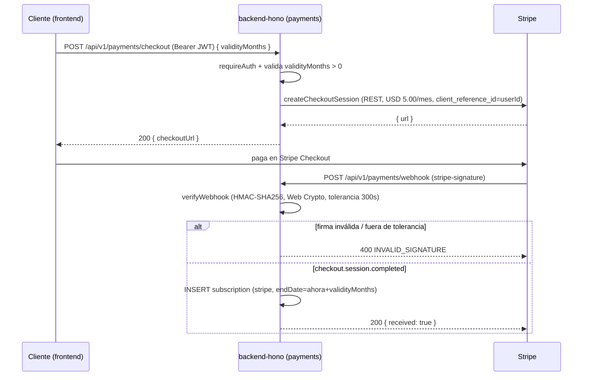

# Flujo: Pago online (Stripe)

[[00_MAPA_DE_CONTENIDOS|Mapa de Contenidos]]

Cómo un cliente compra una suscripción premium con tarjeta vía **Stripe Checkout**. Módulo 🔒 [[04_Modulos/Pagos|Pagos]]. Decisión en [[02_Arquitectura/adr/0003-pagos-stripe-via-rest-en-edge|ADR-0003]].

## Actores
- Cliente autenticado (frontend), backend (`payments`), Stripe.

## Secuencia

## Reglas
- El **checkout** exige `requireAuth`; el `userId` (claim `sub`) viaja como `client_reference_id`.
- El **webhook** es público pero solo se procesa si la **firma** de Stripe es válida y reciente.
- Solo `checkout.session.completed` activa la suscripción (`paymentMethod = "stripe"`).
- Tras la activación, el acceso sigue el [[05_Procesos/Flujo_Acceso_Premium|flujo premium]].

## Pendiente
- **Idempotencia del webhook** (deduplicar por `event.id`/sesión) y manejo de reembolsos/renovación. Ver [[04_Modulos/Pagos|módulo]].

## Historial de cambios
- 2026-06-21: creación — flujo Stripe checkout → webhook firmado → suscripción.
