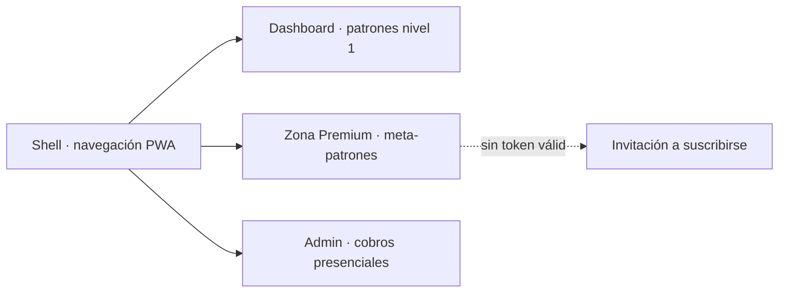

# Mapa de navegación

[[00_MAPA_DE_CONTENIDOS|Mapa de Contenidos]]

Vistas del [[04_Modulos/Frontend|frontend Astro]] (móvil-first), montadas sobre el **Shell** (`src/layouts/Shell.astro`, shell PWA con navegación).

## Vistas (páginas reales)
- **Dashboard** (`src/pages/index.astro`): patrones de nivel 1 públicos (fríos/calientes, rachas inversas, par/impar, numerología de sueños). Usa el componente `NumberBalls.astro`. Acceso público/freemium.
- **Zona Premium** (`src/pages/premium.astro`): meta-patrones de nivel 2; **gate por token de suscriptor** (Bearer JWT); si no hay acceso, invita a suscribirse. Ver [[05_Procesos/Flujo_Acceso_Premium|flujo premium]] y [[05_Procesos/Flujo_Pago_Online|pago online]].
- **Admin** (`src/pages/admin.astro`): formulario de registro de [[05_Procesos/Flujo_Cobro_Presencial|cobro presencial]], con protección **anti doble-click**. Acceso restringido por rol.

## Diagrama

## Reglas de acceso
- Dashboard: público.
- Zona Premium: requiere suscripción vigente (gate por token; ver [[05_Procesos/Flujo_Acceso_Premium|flujo premium]]).
- Admin: rol `admin`/`clerk`.

## Componentes y cliente
- **Shell:** `src/layouts/Shell.astro`. **NumberBalls:** `src/components/NumberBalls.astro`. **Cliente API:** `src/lib/api.ts`.
- Estilos con **Tailwind CSS** (`@astrojs/tailwind`).

## Pendiente
- Design system formal (tokens, componentes reutilizables) y wireframes de alta fidelidad; falta una pantalla de **login** propia.

## Historial de cambios
- 2026-06-21: documentadas las 3 páginas reales (Dashboard, Premium, Admin), el Shell, `NumberBalls` y Tailwind. Estado activo; resuelto el pendiente de andamiaje.
- 2026-06-20: creación inicial.
