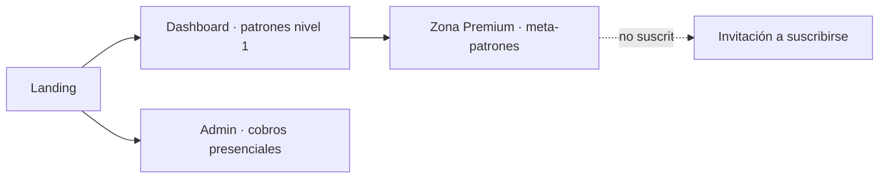

# Mapa de navegación

[[00_MAPA_DE_CONTENIDOS|Mapa de Contenidos]]

Vistas principales del [[04_Modulos/Frontend|frontend Astro]] (móvil-first). Estado: andamiaje — solo existe la Landing.

## Vistas
- **Landing:** presentación del producto; punto de entrada público.
- **Dashboard:** patrones de nivel 1 (fríos/calientes, rachas inversas, par/impar, numerología de sueños) por tipo de juego. Acceso público/freemium.
- **Zona Premium:** meta-patrones de nivel 2; visible solo con [[01_Dominio/Glosario#Acceso y cobro|suscripción activa y vigente]]; si no, invita a suscribirse.
- **Admin (cobros):** pantalla para que admin/clerk registre [[05_Procesos/Flujo_Cobro_Presencial|cobros presenciales]]. Acceso restringido por rol.

## Diagrama

## Reglas de acceso
- Dashboard: público.
- Zona Premium: requiere suscripción vigente (ver [[05_Procesos/Flujo_Acceso_Premium|flujo premium]]).
- Admin: rol `admin`/`clerk`.

## Pendiente
- Mockups, design system (shadcn/ui + Tailwind) y wireframes detallados; aún no existen.

## Historial de cambios
- 2026-06-20: creación inicial.
